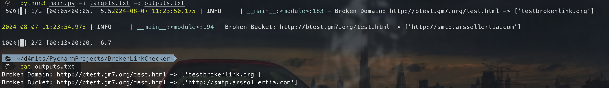

## 简介

一个用于寻找 Broken Link 和 Broken Bucket 的小脚本。


Broken Link： 如一些网站中引入了第三方的JS，而这个第三方的域名可能已经过期了没人管，这个时候我们如果去注册了这个域名，就相当于可以控制网站中的JS了。

Broken Bucket： 和上面类似，区别就在于是存储桶过期了，我们可以去接管这个存储桶达到控制JS的目的。

## 实现过程

1. 获取网页内容提取URL
2. 给URL提取成域名，并进行whois查询，确认是否注册
3. 检查提取出的URL，看是否存在存储桶接管

## 用法

```
   python3 main.py -h            
usage: main.py [-h] -i INPUT [-t THREADS] [-o OUTPUT] [-v]

输入URL列表，输出每个URL包含的链接中是否存在可以接管的Broken Link

optional arguments:
  -h, --help            show this help message and exit
  -i INPUT, --input INPUT
                        输入文件的路径
  -t THREADS, --threads THREADS
                        并发线程数，默认10
  -o OUTPUT, --output OUTPUT
                        输出文件的路径
  -v, --verbose         启用详细模式
```


